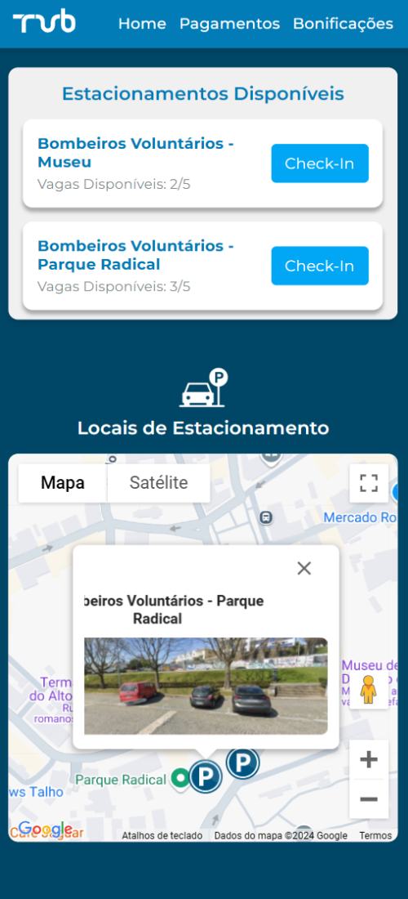
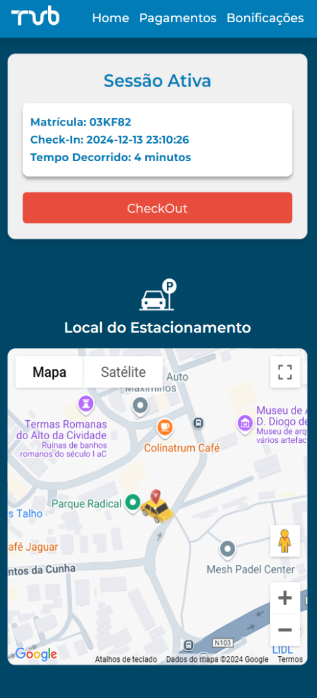
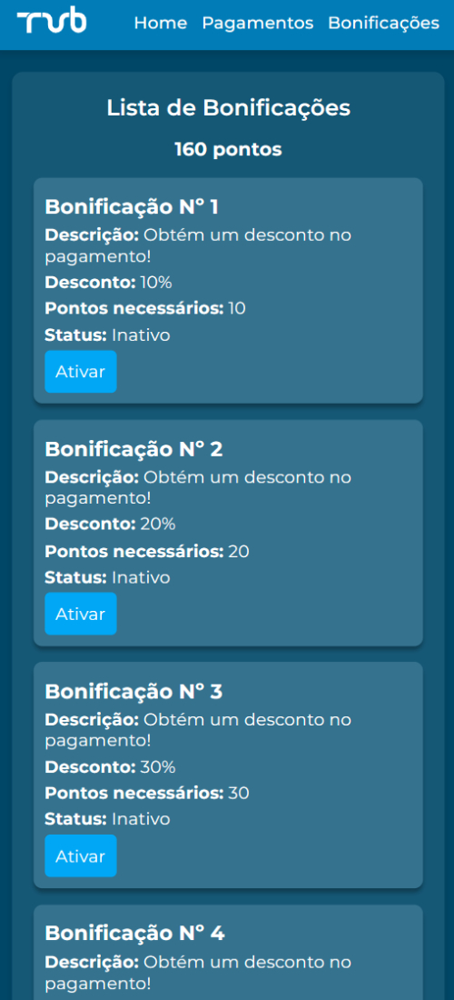
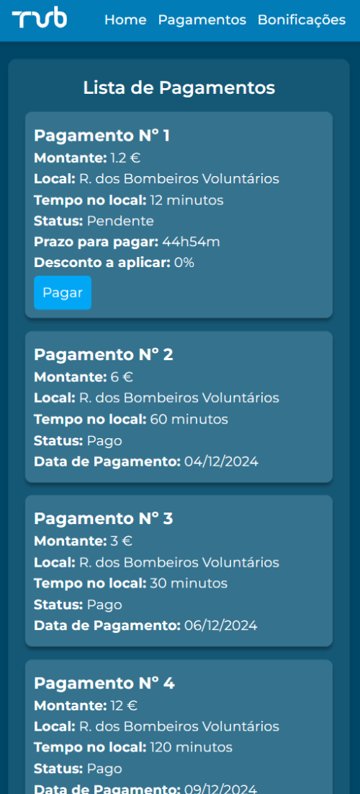
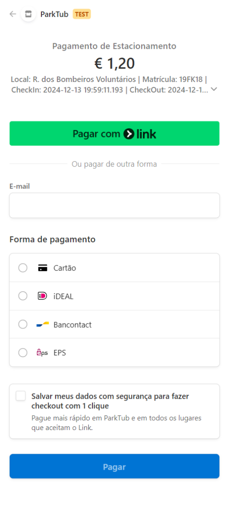

# ParkTub - Urban Transport Parking System

ParkTub is an online platform designed for managing parking spaces, payments, and discounts for users of the Transportes Urbanos de Braga (TUB) service. Users can view available parking spaces, apply for discounts/bonuses, and manage their parking payments seamlessly. The project is split into two main parts: the Frontend (the user interface) and the Backend (the API for handling parking data and payments).

# Why? (Motivation / Problem to Solve)

ParkTub aims to simplify parking management for urban transport users. By offering real-time parking information, convenient payment options, and personalized discounts, the platform enhances user experience and efficiency in urban mobility services.

## Features

- **Real-Time Parking Lot Updates**: Parking lot availability is dynamically updated through seamless integration with Niop, Kafka and SSE (Server-Sent Events), ensuring users always have the latest information on available spots.
- **Parking Session Management**: Users can manage their parking sessions with ease, including creating new sessions (check-in), viewing ongoing sessions, and finalizing sessions (check-out).
- **Payment Management**: Provides a comprehensive overview of all user payments, allowing them to view details, make payments, and track their payment history.
- **Bonus Rewards**: Users can access and activate available bonuses, redeeming their points for rewards and benefits seamlessly.
- **Mobile Design**: Access the platform on smartphones for seamless user experience.

## Technologies Used

- **Frontend**:

  - **React** - JavaScript library for building user interfaces.
  - **HTML** - Structure of the web application.
  - **CSS** - For styling the website and creating a responsive design.
  - **JavaScript** - Used for client-side logic and interactivity.
  - **Google Maps API** - For displaying real-time available parking spots on a map and assisting users in locating them.

- **Backend**:
  - **Microservices Architecture** - The backend is structured into independent services, promoting scalability and fault tolerance.
  - **Docker**: A containerization platform used to package and deploy the application in lightweight, isolated environments, ensuring consistency across different environments and simplifying the deployment process.
  - **Java** - Programming language used for backend development.
  - **Spring Boot**: Framework for building the backend API and handling HTTP requests.
  - **Spring Data JPA**: Simplifies database interaction by providing an abstraction layer for managing data persistence.
  - **Spring Validation**: Framework used for validating input data, ensuring correctness and adherence to defined rules.
  - **Spring Cloud**: Provides tools for deploying and managing distributed systems.
  - **Spring Config**: Centralized configuration management for microservices.
  - **MySQL** - Relational database for storing parking, payment, and user data.
  - **Stripe** - Payment processing system for handling parking payments.
  - **Niop** - A low-code platform that simplifies the orchestration of intelligent systems, enabling easy programming of machines integrating AI, robotics, and automation.
  - **Kafka** - A distributed messaging system designed for high-throughput, real-time data streaming and synchronization, ensuring accurate updates of parking space availability.
  - **SSE (Server-Sent Events)**: Establishes a one-way connection from the server to the client, allowing real-time updates (e.g., parking lot availability) directly to the client over HTTP.
  - **Zipkin**: A distributed tracing system that helps monitor and troubleshoot the performance of microservices, providing detailed insights into latency and inter-service communication.

## How to Run the Project Locally

### Installation Steps

1. **Clone the repository:**

   ```bash
   git clone https://github.com/LuisSilva7/parkTub-project.git
   ```

2. **Navigate to the project backend directory:**

   ```bash
   cd parkTub-project/parkTub-backend
   ```

3. **Run all containers:**

   ```bash
   docker compose up -d
   ```

4. **Install project dependencies:**

   ```bash
   mvn spring-boot:run
   ```

5. **Navigate to the project frontend directory:**

   ```bash
   cd parkTub-project/parkTub-frontend
   ```

6. **Install project dependencies:**

   ```bash
   npm install
   ```

7. **Start the development server:**
   ```bash
   npm run dev
   ```

The application will be available at [http://localhost:5173](http://localhost:5173) in your browser.

## Screenshots

### Home Page



### Home2 Page



### Bonus Page



### Payments Page



### Stripe Page



### Maintainer

- **Luis Silva** (Owner/Developer)
